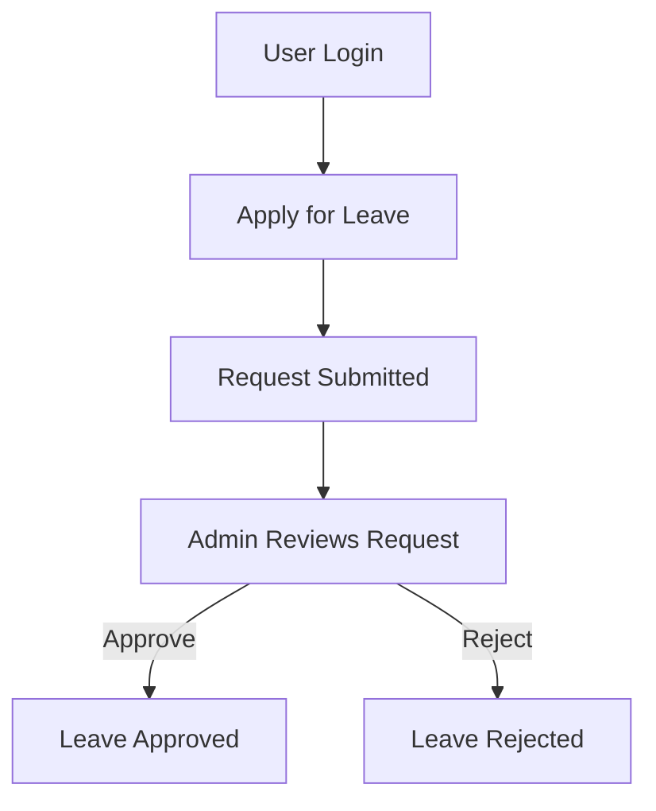

# 🚀 Leave Approval System

A web-based **Leave Approval System** that streamlines the process of applying, managing, and approving employee leave requests. This project replaces manual workflows with a structured digital system, improving efficiency, transparency, and record-keeping.

---

## 📌 Overview

Managing employee leave manually can be slow, error-prone, and difficult to track. This system provides a centralized platform where:

* Employees can apply for leave
* Admins can approve or reject requests
* Leave history is maintained for future reference

---

## ✨ Key Features

* 🔐 Secure User Authentication (Login System)
* 📝 Apply for Leave Requests
* 📊 Track Leave Status (Pending / Approved / Rejected)
* 🛡️ Admin Dashboard for Managing Requests
* 📁 Maintain Leave History
* ⚡ Simple and Clean User Interface

---

## 🧠 Workflow



---

## 🛠️ Tech Stack

* **Frontend:** HTML, CSS, JavaScript
* **Backend:** (Based on your implementation — e.g., Java / Node.js / PHP)
* **Database:** MySQL / MongoDB
* **Tools:** Git, GitHub

---

## 📂 Project Structure

```
Leave-Approval-System/
│── src/
│── public/
│── assets/
│── database/
│── README.md
```

---

## ⚙️ Installation & Setup

### 1️⃣ Clone the Repository

```
git clone https://github.com/shreshthisuman25/Leave-Approval-System.git
cd Leave-Approval-System
```

### 2️⃣ Setup the Environment

* Install required dependencies (if applicable)
* Configure your backend server
* Connect to your database

### 3️⃣ Run the Application

```
npm start
```

*(or use your backend server command depending on your tech stack)*

---

## 👥 User Roles

### 👤 Employee

* Apply for leave
* View leave status
* Check leave history

### 🛡️ Admin

* View all leave requests
* Approve or reject requests
* Manage records

---

## 📸 Screenshots

> Add screenshots here to showcase UI (Highly Recommended)

---

## 🚧 Future Enhancements

* 🔔 Email Notifications for Leave Status
* 📅 Calendar Integration
* 📊 Admin Analytics Dashboard
* 📱 Mobile Responsive Design
* 🤖 Smart Leave Approval Suggestions

---

## 🤝 Contributing

Contributions are welcome!

1. Fork the repository
2. Create a new branch
3. Make your changes
4. Submit a Pull Request

---

## 📄 License

This project is open-source and available under the MIT License.

---

## 👩‍💻 Author

**Shreshthi Suman**
GitHub: https://github.com/shreshthisuman25

---

## ⭐ Support

If you found this project useful:

* ⭐ Star the repository
* 🍴 Fork and improve it
* 📢 Share with others

---
